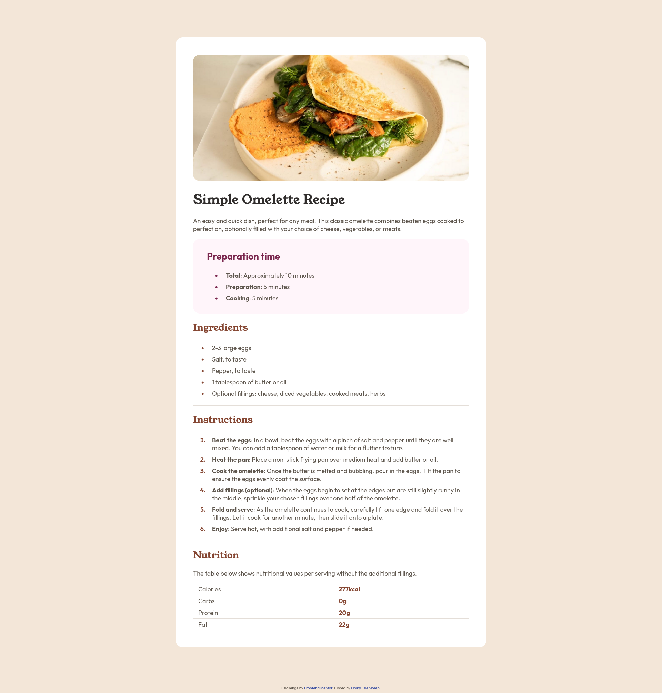
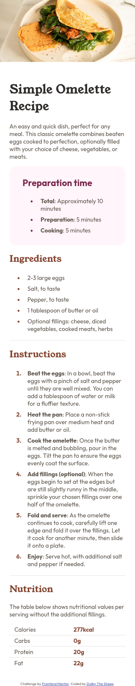

# Frontend Mentor - Recipe page solution

This is a solution to the [Recipe page challenge on Frontend Mentor](https://www.frontendmentor.io/challenges/recipe-page-KiTsR8QQKm). Frontend Mentor challenges help you improve your coding skills by building realistic projects. 

## Table of contents

- [Overview](#overview)
  - [The challenge](#the-challenge)
  - [Screenshot](#screenshot)
  - [Links](#links)
- [My process](#my-process)
  - [Built with](#built-with)
  - [What I learned](#what-i-learned)

**Note: Delete this note and update the table of contents based on what sections you keep.**

## Overview

### Screenshot
|                 Desktop                         |                    Mobile                     |
|-------------------------------------------------|-----------------------------------------------|
|||


### Links

- Solution URL: [Add solution URL here](https://github.com/DolbyTheSheep/Recipe-Page.git)
- Live Site URL: [Add live site URL here](https://dolbythesheep.github.io/Recipe-Page/)

## My process

### Built with

- Semantic HTML5 markup
- CSS custom properties
- Flexbox

**Note: These are just examples. Delete this note and replace the list above with your own choices**

### What I learned

The hard part was drawing the separation lines between the table's rows. 

```css
tr { 
    border: solid;
    border-width: 1px 0;
    border-color: hsl(30, 18%, 87%);
}

tr:first-child, tr:last-child {
    border: none;
}
```